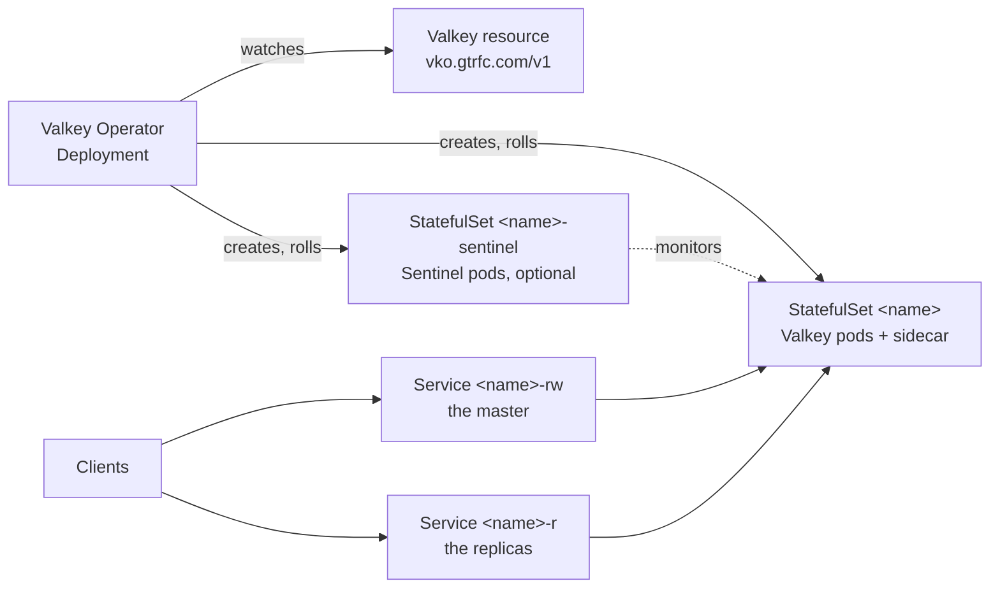

# Valkey Operator

[](https://github.com/guided-traffic/valkey-operator/actions)
[](https://github.com/guided-traffic/valkey-operator)
[](https://goreportcard.com/report/github.com/guided-traffic/valkey-operator)
[](LICENSE)

A Kubernetes operator for deploying and managing production-grade
[Valkey](https://valkey.io/) instances — standalone or highly available with Sentinel.
One resource, `Valkey` (`vko.gtrfc.com/v1`), describes the whole cluster — the data pods,
the optional Sentinel tier, TLS, persistence and monitoring — and the operator creates and
owns the StatefulSets, Services and ConfigMaps behind it.



<a id="features"></a>

## ✨ Key features

- 🧩 **Standalone & HA modes** — single-node or multi-node with automatic Sentinel deployment
- 🔒 **TLS encryption** — full TLS for Valkey, replication, and Sentinel via cert-manager or user-provided Secrets
- 🔓 **Dual-port mode** — optional `allowUnencrypted` flag keeps plaintext ports open alongside TLS for gradual migration
- 💾 **Persistence** — RDB, AOF, or both with configurable PVCs
- 🔑 **Authentication** — password from Kubernetes Secret
- 👀 **Observability** — CRD status visible in `kubectl` and Lens, Kubernetes Events
- 🔄 **Controlled rolling updates** — replica-first rollout with replication sync verification and automatic failover
- 🛡️ **Rootless pods** — every generated pod runs as a non-root user with all capabilities dropped, a read-only root filesystem and a seccomp filter, so it is admitted in a namespace enforcing Pod Security `restricted`
- 🧱 **Pod hardening knobs** — [`spec.podSecurity`](#specpodsecurity) picks the seccomp profile (`RuntimeDefault`, or a `Localhost` profile an administrator has put on the operator's allow-list — never `Unconfined`) and opts into user namespaces (`hostUsers: false`); images can be pinned by digest
- 🩺 **Cluster Observer** — optional diagnostic deployment that continuously verifies cluster health (master reachable, replication sync, write/read tests, Sentinel quorum) and exposes Prometheus metrics
- 📊 **Metrics exporter** — optional per-pod Prometheus exporter sidecar with a dedicated Service and Prometheus-Operator `ServiceMonitor`; enabling it on a running cluster migrates through the failover-aware rolling update, which keeps the pre-roll dataset; on a Sentinel cluster whose Sentinels cannot run a coordinated failover (before Valkey 9.0, the 8 to 9 upgrade roll included) and on any roll whose coordinated failover fell back to forced, the writes the outgoing master acknowledges during the roll's failover are lost ([the master handover](docs/operations/rolling-updates.md#the-master-handover-on-a-sentinel-cluster))
- 🚧 **Disruption budgets** — optional PodDisruptionBudgets that keep a node drain from evicting all data pods or the Sentinel quorum at once
- 🧭 **Pod anti-affinity** — opt-in spreading of data and Sentinel pods across nodes: `mode: soft` (scheduler preference) or `mode: hard` (guaranteed spread)
- 🌐 **Network policies** — optional ingress policies that admit only the operator's own components; your clients and scrapers stay yours to admit
- ⎈ **Helm deployment** — install the operator with a single `helm install`

<a id="naming-conventions"></a>

## 📛 Naming conventions

Every name the operator generates is derived from the name of the `Valkey` resource,
written `<name>` below. Several `Valkey` resources can therefore share a namespace, and a
name another object already holds is reported, never taken over.

<a id="common-labels"></a>

### Labels

All managed resources carry a consistent set of labels:

| Label | Value |
|---|---|
| `app.kubernetes.io/component` | `valkey` \| `sentinel` \| `observer` |
| `app.kubernetes.io/instance` | `<cr-name>` |
| `app.kubernetes.io/managed-by` | `vko.gtrfc.com` |
| `app.kubernetes.io/name` | `valkey` |
| `app.kubernetes.io/version` | `<image-tag>` |
| `vko.gtrfc.com/cluster` | `<cr-name>` |

`app.kubernetes.io/version` is the tag of `spec.image`. A digest is never used as the value
(it does not fit a label): `repo:tag@sha256:…` yields the tag, a digest-only reference an
empty value, and a reference with neither tag nor digest `latest`. The tag is used as it is:
one that is not a valid label value — longer than 63 characters, or not beginning and ending
with a letter or digit — makes the API server refuse every object carrying the label (read
from the code, not measured).

The observer Deployment, its pod, its ServiceAccount and its NetworkPolicy carry
`component: observer` and no `app.kubernetes.io/version` label *(corrected 2026-09-27: this
table gave every managed resource `component: valkey | sentinel` and the version label; the
observer objects are labelled by `ObserverLabels` in
[`internal/builder/observer.go`](internal/builder/observer.go), not by `BaseLabels`)*.

~~Pod-level labels additionally include:~~ Data pods additionally carry one label, which their
sidecar writes onto its own pod once it has detected the role. The label is absent at pod
creation, and the operator never writes it:

| Label | Value |
|---|---|
| `vko.gtrfc.com/instanceRole` | `master` \| `replica` \| `draining` — `draining` is set by the sidecar on its own pod when that pod is the master and is being terminated, which takes it out of `<name>-rw` |

Sentinel and observer pods carry no generated pod-level label beyond the common set
*(corrected 2026-09-27: this section listed `vko.gtrfc.com/instanceName: <pod-name>` and
`instanceRole` as labels of every pod; nothing writes `instanceName`, and `instanceRole` is
written only by the sidecar of a data pod,
[`internal/sidecar/labeler.go`](internal/sidecar/labeler.go))*.

The metrics Service additionally carries `vko.gtrfc.com/metrics: "true"`, which is what
its ServiceMonitor selects.

<details>
<summary><b>Generated resources</b></summary>

| Kind | Name | Created when |
|---|---|---|
| StatefulSet, data pods | `<name>`; pods `<name>-<ordinal>` | always |
| StatefulSet, Sentinel pods | `<name>-sentinel`; pods `<name>-sentinel-<ordinal>` | `spec.sentinel.enabled` |
| PersistentVolumeClaim | `data-<name>-<ordinal>` | `spec.persistence.enabled` |
| ConfigMap | `<name>-config` | always |
| ConfigMap | `<name>-replica-config` | Sentinel enabled, or more than one replica |
| ConfigMap | `<name>-sentinel-config` | `spec.sentinel.enabled` |
| Service, headless | `<name>-headless` | always |
| Service | `<name>-rw` — the master | always |
| Service | `<name>-r` — the replicas | `spec.replicas` above 1 |
| Service | `<name>-all` — every data pod | `spec.replicas` above 1 |
| Service, headless | `<name>-sentinel-headless` | `spec.sentinel.enabled` |
| Service | `<name>-metrics` | `spec.metrics.enabled` and `spec.metrics.service.enabled` (forced on by an enabled ServiceMonitor) |
| ServiceMonitor | `<name>-metrics` | `spec.metrics.enabled` and `spec.metrics.serviceMonitor.enabled`, and the Prometheus-Operator CRDs installed |
| Certificate and its Secret | `<name>-tls` | TLS through cert-manager |
| Certificate and its Secret | `<name>-sentinel-tls` | TLS through cert-manager, Sentinel enabled, `unifiedCertificate` off |
| TLS Secret | the value of `spec.tls.secretName` | user-provided TLS; not created, shared by Valkey and Sentinel |
| PodDisruptionBudget | `<name>`, `<name>-sentinel` | `spec.podDisruptionBudget.enabled`, and that StatefulSet has at least 2 replicas |
| NetworkPolicy | `<name>`, `<name>-sentinel`, `<name>-observer`, each prefixed with `<namePrefix>-` when `spec.networkPolicy.namePrefix` is set | `spec.networkPolicy.enabled`; the Sentinel and observer ones only with that component |
| ServiceAccount, Role, RoleBinding | `<name>-sidecar` | always — the sidecar in every data pod |
| Deployment, ServiceAccount | `<name>-observer` | `spec.observer.enabled` |

The Sentinel tier monitors the master under the name `<name>` (`sentinel monitor <name> …`).

</details>

<details>
<summary><b>Containers, ports, environment and paths</b></summary>

| What | Names |
|---|---|
| Data pod containers | `valkey`, `sidecar` (port `health`), `exporter` (with `spec.metrics.enabled`) |
| Data pod init containers | `init-config-selector` (Sentinel enabled, or more than one replica); `check-data-writable` (persistent); `fix-data-ownership` (only during the [rootless migration](docs/operations/upgrading.md#one-time-migration-to-rootless-pods)) |
| Sentinel pod containers | `sentinel`; init container `init-sentinel-config` |
| Observer pod container | `observer`, port `health` |
| Port names | `valkey`, `valkey-plain`, `sentinel`, `sentinel-plain`, `metrics` — numbers in the [port summary](docs/operations/tls.md#port-summary) |
| TLS material in the pods | `/tls/tls.crt`, `/tls/tls.key`, `/tls/ca.crt` |
| Data directory | `/data` |
| TLS fingerprint | environment variable `VKO_TLS_MATERIAL_HASH` on the `sidecar` (data) and `sentinel` containers ([certificate rotation](docs/operations/tls.md#certificate-rotation)) |
| Environment, auth password | `VALKEY_PASSWORD` from `spec.auth.secretName`/`secretPasswordKey` when auth is enabled. It goes on the data pod's `valkey` and `sidecar` containers and the `init-config-selector` init container; on the Sentinel pod's `init-sentinel-config`, and on `sentinel` unless `spec.sentinel.disableAuth`; and on `observer`. The exporter gets the same key as `REDIS_PASSWORD` ([secrets and TLS](docs/security/secrets-and-tls.md)) |
| Environment, pod identity | `POD_NAME`, `POD_NAMESPACE` (downward API) on `sidecar`; `POD_NAMESPACE` on `observer` |
| Environment, exporter | `REDIS_ADDR`, `REDIS_EXPORTER_WEB_LISTEN_ADDRESS`, `REDIS_EXPORTER_DISABLE_SCRAPE_ENDPOINT=true`, `REDIS_EXPORTER_DISABLE_EXPORTING_KEY_VALUES=true` always; `REDIS_PASSWORD` with auth; `REDIS_EXPORTER_SKIP_TLS_VERIFICATION`, `REDIS_EXPORTER_TLS_CA_CERT_FILE`, `REDIS_EXPORTER_TLS_CLIENT_CERT_FILE`, `REDIS_EXPORTER_TLS_CLIENT_KEY_FILE` under TLS (on `exporter`, with `spec.metrics.enabled`) |
| Operator metrics | `vko_valkey_*`, `vko_operator_build_info` ([monitoring](docs/operations/monitoring.md#operator-metrics-and-alerting)) |
| Operator release, as installed below | Deployment `valkey-operator` in namespace `valkey-operator-system`, its pod labelled `app.kubernetes.io/component: operator`; pre-upgrade hook Job `valkey-operator-pre-upgrade`; environment `OPERATOR_IMAGE`, `POD_NAMESPACE` on the operator container |

</details>

<details>
<summary><b>Annotations the operator and the sidecar write</b></summary>

| Key | On | Meaning |
|---|---|---|
| `vko.gtrfc.com/known-master` | the `Valkey` resource | The master the operator has recorded for the cluster |
| `vko.gtrfc.com/rolling-update-state`, `failover-timestamp`, `promoted-pod`, `reconnect-reset-count`, `sync-wait-started`, `topology-restore-started`, `manual-failover-started`, `sentinel-awareness-started`, `finalization-started`, `recreation-wait-started`, `handover-hold-started` (all under `vko.gtrfc.com/`) | the `Valkey` resource | State of a rolling update in flight, kept across reconcile passes |
| `vko.gtrfc.com/operator-version` | every resource the operator creates or updates | The operator version that last reconciled it |
| `vko.gtrfc.com/config-hash`, `vko.gtrfc.com/pod-spec-hash` | the pod template of both StatefulSets | Hashes of the generated configuration and of the pod spec; a changed hash is how a rolling update detects a change |
| `vko.gtrfc.com/nudge` | a StatefulSet that is short of pods | A timestamp bump that makes the StatefulSet controller sync at once; never rolls a pod |
| `vko.gtrfc.com/drain-promoted-at` | the data pod the sidecar promoted, written by the sidecar | A promotion the sidecar made while its own master pod was terminating, on a cluster without Sentinel |
| `vko.gtrfc.com/tls-material-hash` | data and Sentinel pods created by older operator versions | Replaced by the `VKO_TLS_MATERIAL_HASH` environment variable; read, never written |

</details>

<a id="documentation"></a>

## 📚 Documentation

| Document | What it covers |
|---|---|
| **[docs/operations/](docs/operations/README.md)** | Running it: installation, upgrading, examples, authentication, TLS, persistence, rolling updates, disruption budgets, anti-affinity, compute resources, network policies, pod security, monitoring, the cluster observer, reading the status |
| **[CRD reference](#crd-reference)** and **[Helm chart values](#helm-chart-values)** (below) | Every `spec` and `status` field and every chart value, with its default |
| **[docs/security/](docs/security/)** | The security architecture: trust boundaries, every RBAC rule the operator and the per-instance sidecar hold and what each one permits, where the password and the TLS material live, and what the isolation does **not** cover |
| **[SECURITY.md](SECURITY.md)** | How to report a vulnerability |
| **[DEVELOPER.md](DEVELOPER.md)** · **[docs/developer/](docs/developer/)** | Changing the code |
| [Valkey documentation](https://valkey.io/topics/) | Upstream server, replication and Sentinel behaviour |
| [cert-manager](https://cert-manager.io/docs/) | Issuers referenced by `spec.tls.certManager` |

Read the security design under [docs/security/](docs/security/) before granting anyone
`create valkeys`: the operator holds a cluster-wide grant that includes reading every
Secret and writing RBAC.

<a id="fast-start"></a>
<a id="quick-start"></a>

## 🚀 Fast start

### Prerequisites

- Kubernetes cluster (v1.29+)
- Helm 3
- [cert-manager](https://cert-manager.io/) (only if using TLS with automatic certificate management)

### Install the operator

```bash
helm repo add valkey-operator https://guided-traffic.github.io/valkey-operator/
helm repo update
helm install valkey-operator valkey-operator/valkey-operator \
  --namespace valkey-operator-system \
  --create-namespace
```

Installing from a checked-out tree, a pinned chart version and the chart settings that
need explaining: [docs/operations/installation.md](docs/operations/installation.md).

### A standalone instance

```yaml
apiVersion: vko.gtrfc.com/v1
kind: Valkey
metadata:
  name: my-valkey
spec:
  replicas: 1
  image: valkey/valkey:8.0
```

```bash
kubectl apply -f my-valkey.yaml
kubectl get valkey
```

```
NAME        REPLICAS   READY   PHASE   MASTER          AGE
my-valkey   1          1       OK      my-valkey-0     2m
```

### High availability with Sentinel

Three Valkey pods (one master, two replicas) and three Sentinels for automatic failover:

```yaml
apiVersion: vko.gtrfc.com/v1
kind: Valkey
metadata:
  name: my-ha
spec:
  replicas: 3
  image: valkey/valkey:8.0
  sentinel:
    enabled: true
    replicas: 3
```

Clients write through the `my-ha-rw` Service and read from `my-ha-r`; a Sentinel-aware
client asks `my-ha-sentinel-headless` for the master named `my-ha`. TLS, persistence,
authentication, metrics and the observer are in
[docs/operations/examples.md](docs/operations/examples.md).

### Verify

```bash
kubectl get valkey
kubectl describe valkey my-ha
```

A cluster is ready when `PHASE` is `OK` and `READY` equals `REPLICAS`. Anything else —
a phase, a condition, `Ready=True` next to `phase=Error` — is explained in
[docs/operations/status.md](docs/operations/status.md).

<details>
<summary><b>Upgrade and uninstall</b></summary>

```bash
helm upgrade valkey-operator valkey-operator/valkey-operator \
  --namespace valkey-operator-system
```

Read [docs/operations/upgrading.md](docs/operations/upgrading.md) before you upgrade: it
says what an upgrade rolls and restarts, what to do beforehand, how to verify it and how
to roll back.

Uninstalling removes every `Valkey` resource together with the CRD — the commands and what
survives are in [docs/operations/installation.md](docs/operations/installation.md#uninstall).

</details>

<a id="crd-reference"></a>

## ⚙️ CRD reference

Every field of the `Valkey` resource (`vko.gtrfc.com/v1`, short name `vk`). A default is
the value the API server or the operator applies when the field is omitted; — means none.
**This reference lives here and nowhere else**: what a setting does beyond its row is on
the page named under its table.

### `spec`

| Field | Type | Default | Description |
|-------|------|---------|-------------|
| `replicas` | `int32` | `1` | Number of Valkey instances |
| `image` | `string` | *(required)* | Valkey container image (e.g., `valkey/valkey:8.0`). May be pinned by digest (`valkey/valkey:8.0@sha256:<64 hex>`); the `app.kubernetes.io/version` label then takes the tag, and is empty for a digest-only reference. |
| `sentinel` | `SentinelSpec` | — | Sentinel HA configuration |
| `auth` | `AuthSpec` | — | Authentication configuration |
| `tls` | `TLSSpec` | — | TLS encryption configuration |
| `metrics` | `MetricsSpec` | — | Metrics exporter configuration |
| `networkPolicy` | `NetworkPolicySpec` | — | NetworkPolicy configuration — see [`spec.networkPolicy`](#specnetworkpolicy) |
| `persistence` | `PersistenceSpec` | — | Data persistence configuration |
| `observer` | `ObserverSpec` | — | Cluster observer configuration |
| `podDisruptionBudget` | `PodDisruptionBudgetSpec` | — | PodDisruptionBudgets for the data and Sentinel StatefulSets |
| `antiAffinity` | `AntiAffinitySpec` | *(off)* | Opt-in pod anti-affinity for the data and Sentinel StatefulSets |
| `podSecurity` | `PodSecuritySpec` | *(`RuntimeDefault`, no user namespace)* | Seccomp profile and opt-in user namespace of the data, Sentinel and observer pods — see [`spec.podSecurity`](#specpodsecurity) |
| `rollingUpdate` | `RollingUpdateSpec` | — | Rolling update timing |
| `podLabels` | `map[string]string` | — | Additional labels for Valkey pods |
| `podAnnotations` | `map[string]string` | — | Additional annotations for Valkey pods |
| `resources` | `ResourceRequirements` | — | CPU/memory requests and limits |

Examples for every common shape: [examples.md](docs/operations/examples.md).

### `spec.sentinel`

| Field | Type | Default | Description |
|-------|------|---------|-------------|
| `enabled` | `bool` | `false` | Enable Sentinel HA mode |
| `replicas` | `int32` | `3` | Number of Sentinel instances |
| `allowUnencrypted` | `bool` | `false` | Keep plaintext Sentinel port (`26379`) open alongside TLS port (`36379`). Only effective when `spec.tls.enabled: true`. |
| `disableAuth` | `bool` | `false` | Disable password authentication for Sentinel client connections. Sentinel still uses `auth-pass` to connect to Valkey nodes. Only effective when `spec.auth` is configured. |
| `podLabels` | `map[string]string` | — | Additional labels for Sentinel pods |
| `podAnnotations` | `map[string]string` | — | Additional annotations for Sentinel pods |
| `resources` | `ResourceRequirements` | — *(no default: no requests, no limits)* | CPU/memory for **every** container of a Sentinel pod — the `sentinel` container and the `init-sentinel-config` init container get the same values, so a cpu/memory `ResourceQuota` admits the pod once the values that quota tracks are set here. Changing it rolls the Sentinel tier. |

Explained in: [compute-resources.md](docs/operations/compute-resources.md) (`resources`), [tls.md](docs/operations/tls.md#dual-port-mode-allowunencrypted) (`allowUnencrypted`), [examples.md](docs/operations/examples.md#ha--with-authentication-sentinel-unauthenticated) (`disableAuth`).

### `spec.auth`

| Field | Type | Default | Description |
|-------|------|---------|-------------|
| `secretName` | `string` | — | Kubernetes Secret name containing the password |
| `secretPasswordKey` | `string` | `password` | Key within the Secret |

Example: [examples.md](docs/operations/examples.md#ha--with-authentication). Explained in: [authentication.md](docs/operations/authentication.md).

### `spec.tls`

| Field | Type | Default | Description |
|-------|------|---------|-------------|
| `enabled` | `bool` | `false` | Enable TLS encryption |
| `allowUnencrypted` | `bool` | `false` | Keep plaintext Valkey port (`6379`) open alongside TLS port (`16379`). Replication always uses TLS. |
| `unifiedCertificate` | `bool` | `false` | Make Valkey and Sentinel share one TLS Secret covering both sets of hostnames. Under cert-manager, one `Certificate` is issued instead of two; under a user-provided Secret, the flag is informational. See [Unified TLS Certificate](docs/operations/tls.md#unified-tls-certificate-valkey--sentinel). |
| `certManager` | `CertManagerSpec` | — | cert-manager integration (mutually exclusive with `secretName`) |
| `secretName` | `string` | — | Name of existing TLS Secret (must contain `tls.crt`, `tls.key`, `ca.crt`) |

Explained in: [tls.md](docs/operations/tls.md).

### `spec.tls.certManager`

| Field | Type | Description |
|-------|------|-------------|
| `issuer.kind` | `string` | `Issuer` or `ClusterIssuer` |
| `issuer.name` | `string` | Name of the issuer resource |
| `issuer.group` | `string` | API group (default: `cert-manager.io`) |
| `extraDnsNames` | `[]string` | Additional DNS names for the certificate |

### `spec.metrics`

| Field | Type | Default | Description |
|-------|------|---------|-------------|
| `enabled` | `bool` | `false` | Add a Prometheus exporter sidecar to each Valkey pod |
| `image` | `string` | `oliver006/redis_exporter:v1.92.1@sha256:7fbc93d30f0f91eed1b2fe6968a956259cc5d260a984dd9071f1d1e9c2692ecd` | Exporter container image. The default is pinned by the digest of the multi-arch image index behind the tag, so a re-pushed tag cannot change what runs; the tag is kept for the reader. It is not updated automatically. An image you set here is used as given — pin it by digest the same way. **Use v1.83.0 or later:** an older image starts, but keeps the `/scrape` route the operator switches off ([monitoring.md](docs/operations/monitoring.md#the-exporter-sidecar)). |
| `port` | `int32` | `9121` | Container/Service port serving `/metrics` (named `metrics`), plain HTTP without authentication |
| `resources` | `ResourceRequirements` | — | CPU/memory requests and limits for the exporter container |
| `extraArgs` | `[]string` | — | Additional command-line arguments passed to the exporter (e.g. `["--check-keys=*"]`) |
| `service` | `MetricsServiceSpec` | — | Dedicated metrics Service configuration |
| `serviceMonitor` | `ServiceMonitorSpec` | — | Prometheus-Operator ServiceMonitor configuration |

Explained in: [monitoring.md](docs/operations/monitoring.md#the-exporter-sidecar).

### `spec.metrics.service`

| Field | Type | Default | Description |
|-------|------|---------|-------------|
| `enabled` | `bool` | `true` | Create the dedicated `<name>-metrics` Service. An enabled `serviceMonitor` forces this on regardless. |
| `labels` | `map[string]string` | — | Additional labels applied to the metrics Service |

### `spec.metrics.serviceMonitor`

Requires the Prometheus-Operator CRDs (`monitoring.coreos.com`) to be installed; what happens without them is in [monitoring.md](docs/operations/monitoring.md#the-exporter-sidecar).

| Field | Type | Default | Description |
|-------|------|---------|-------------|
| `enabled` | `bool` | `false` | Create a ServiceMonitor selecting the metrics Service |
| `interval` | `string` | `30s` | Scrape interval |
| `scrapeTimeout` | `string` | — | Per-scrape timeout (empty = Prometheus default) |
| `labels` | `map[string]string` | — | Additional labels, commonly used to match a Prometheus instance's `serviceMonitorSelector` (e.g. `release: prometheus`) |

### `spec.networkPolicy`

| Field | Type | Default | Description |
|-------|------|---------|-------------|
| `enabled` | `bool` | `false` | Create an ingress NetworkPolicy for the data pods, and one each for the Sentinel and observer pods where those are enabled. They admit only the operator's own components; `false` deletes them |
| `namePrefix` | `string` | — | Prepended, followed by `-`, to the names of the generated NetworkPolicies; a change replaces them |

Explained in: [network-policy.md](docs/operations/network-policy.md).

### `spec.persistence`

| Field | Type | Default | Description |
|-------|------|---------|-------------|
| `enabled` | `bool` | `false` | Enable persistent storage |
| `mode` | `string` | `rdb` | Persistence mode: `rdb`, `aof`, or `both` |
| `storageClass` | `string` | `""` | StorageClass name (empty = default) |
| `size` | `Quantity` | `1Gi` | Requested storage size |

Explained in: [persistence.md](docs/operations/persistence.md) — **read it before changing the storage of an existing cluster**.

### `spec.observer`

| Field | Type | Default | Description |
|-------|------|---------|-------------|
| `enabled` | `bool` | `false` | Deploy a diagnostic observer alongside the cluster |
| `db` | `int` | `15` | Valkey database index (0–15) used for the health check key |
| `logLevel` | `string` | `info` | Log verbosity: `debug`, `info`, `warn`, `error`. At `debug`, stack traces are included for all errors. At `info` and above, stack traces are suppressed. |
| `mtls` | `ObserverMTLSSpec` | — | Controls whether the observer sends a client certificate to Valkey and/or Sentinel. Only effective when `spec.tls.enabled: true`. |
| `resources` | `ResourceRequirements` | 50m/64Mi request, no limit *(corrected 2026-09-27: this row said "128Mi limit", which the operator never set)* | CPU/memory for the observer container |
| `unreadyWhen` | `ObserverUnreadyWhenSpec` | all `true` | Per-check control over whether a failure causes the observer to report unReady. Failures are always logged regardless of this setting. |

Explained in: [observer.md](docs/operations/observer.md).

### `spec.observer.unreadyWhen`

| Field | Default | Check description |
|-------|---------|-------------------|
| `masterUnreachable` | `true` | PING to the current master fails |
| `writeTestFailure` | `true` | Health key cannot be written to the master |
| `readTestFailure` | `true` | Health key cannot be read back from the master |
| `replicaSyncFailure` | `true` | A replica is disconnected or bulk sync is in progress (_replicas > 1 only_) |
| `replicaReadTestFailure` | `true` | A replica returns stale or missing health key data (_replicas > 1 only_) |
| `sentinelUnreachable` | `true` | One or more Sentinel instances do not respond to PING (_sentinel only_) |
| `sentinelQuorumFailure` | `true` | Sentinels disagree on the current master address (_sentinel only_) |
| `sentinelMasterDown` | `true` | Sentinel reports `s_down` or `o_down` flags on the master (_sentinel only_) |
| `sentinelMasterHostnameInvalid` | `true` | Sentinel reports a bare IP instead of a DNS hostname for the master (_sentinel only_) |
| `sentinelReplicaHostnamesInvalid` | `true` | Sentinel reports bare IPs for one or more replicas (_sentinel only_) |

Explained in: [observer.md](docs/operations/observer.md#which-failures-make-it-unready-unreadywhen).

### `spec.observer.mtls`

| Field | Type | Default | Description |
|-------|------|---------|-------------|
| `valkey` | `bool` | `false` | Send client certificate to Valkey pods (mTLS). When `false`, the observer uses server-only TLS. |
| `sentinel` | `bool` | `false` | Send client certificate to Sentinel pods (mTLS). When `false`, the observer uses server-only TLS. |

Explained in: [observer.md](docs/operations/observer.md#mutual-tls-mtls).

### `spec.podDisruptionBudget`

| Field | Type | Default | Description |
|-------|------|---------|-------------|
| `enabled` | `bool` | `false` | Create a PDB for the data StatefulSet and, with Sentinel enabled, a quorum-preserving PDB for the Sentinel StatefulSet |
| `maxUnavailable` | `int32` | `1` | Data pods that may be disrupted voluntarily at the same time. Applies to the data StatefulSet only |

Explained in: [disruption-budgets.md](docs/operations/disruption-budgets.md).

### `spec.antiAffinity`

| Field | Type | Default | Description |
|-------|------|---------|-------------|
| `mode` | `string` | `off` | `off` (no term), `soft` (scheduler preference) or `hard` (guaranteed spread) |
| `topologyKey` | `string` | `kubernetes.io/hostname` | Node label whose values define the spread domains |

Explained in: [anti-affinity.md](docs/operations/anti-affinity.md).

### `spec.rollingUpdate`

| Field | Type | Default | Description |
|-------|------|---------|-------------|
| `syncTimeout` | `Duration` | `5m` | How long the operator waits for a replaced pod to finish replication sync before it stops waiting, how long a rolling update waits on a pod that never becomes available before it reports that pod, and how long a held delete of the outgoing master lasts before it is reported as `MasterHandoverStalled` (the hold itself does not end) |

Explained in: [rolling-updates.md](docs/operations/rolling-updates.md).

### `spec.podSecurity`

| Field | Type | Default | Description |
|-------|------|---------|-------------|
| `seccompProfile.type` | `string` | `RuntimeDefault` | `RuntimeDefault` (the container runtime's default filter) or `Localhost` (a profile file installed on the node). `Unconfined` is refused by the CRD, so every generated pod runs under a seccomp filter and Pod Security `restricted` stays satisfiable. A `Localhost` profile is written only when the operator's allow-list names it — see [the allow-list](docs/operations/pod-security.md#localhost-profiles-need-the-operators-allow-list). |
| `seccompProfile.localhostProfile` | `string` | — | Path of the profile relative to the kubelet's seccomp directory (by default `/var/lib/kubelet/seccomp`). Required with `Localhost`, refused with `RuntimeDefault`; an absolute path (leading `/`) and a `..` path element are refused as well. All of this is checked by two CEL rules on the CRD, so the API server rejects the `Valkey` itself. The value has to equal an entry of the operator's allow-list character for character — there is no path normalisation. |
| `userNamespaces` | `bool` | `false` | `true` sets `hostUsers: false`: each pod gets a user namespace of its own, and uid 999 (65532 in the observer) in the container maps to an unprivileged uid on the node. |

Explained in: [pod-security.md](docs/operations/pod-security.md).

### `status`

| Field | Type | Description |
|-------|------|-------------|
| `readyReplicas` | `int32` | Number of ready Valkey instances |
| `masterPod` | `string` | Name of the current master pod |
| `observerReady` | `bool` | Whether the observer Deployment has a ready replica (only set when `observer.enabled: true`). The observer's readiness is its own last cluster health verdict, so this is a health signal, not a rollout signal. A Deployment holding the generated name that this `Valkey` does not control reads as **not** ready. |
| `phase` | `string` | Current lifecycle phase |
| `message` | `string` | Human-readable status description |
| `operatorVersion` | `string` | Version of the operator that last reconciled this resource |
| `conditions` | `[]Condition` | Standard Kubernetes conditions |

How to read it — `Ready` against `phase`, and every condition in full: [status.md](docs/operations/status.md).

#### Condition Types

A **level** is re-measured on every pass, an **edge** records something and is cleared where the operator can prove it is over, **history** is a verdict about a finished operation and is never cleared.

| Type | Kind | What `True` means |
|------|------|-------------------|
| `Ready` | level | [status.md](docs/operations/status.md#ready) |
| `RollingUpdatePaused` | edge | [status.md](docs/operations/status.md#rollingupdatepaused) |
| `TopologyRestored` | history | [status.md](docs/operations/status.md#topologyrestored) |
| `SidecarUpdatePending` | edge | [status.md](docs/operations/status.md#sidecarupdatepending) |
| `PodSecurityUpdatePending` | level | [status.md](docs/operations/status.md#podsecurityupdatepending) |
| `ReconcileBlocked` | level | [status.md](docs/operations/status.md#reconcileblocked) |
| `StorageSpecNotApplied` | level | [status.md](docs/operations/status.md#storagespecnotapplied) |
| `SentinelPeersStale` | level | [status.md](docs/operations/status.md#sentinelpeersstale) |
| `SentinelUpdatePending` | level | [status.md](docs/operations/status.md#sentinelupdatepending) |
| `PodTerminationStalled` | edge | [status.md](docs/operations/status.md#podterminationstalled) |
| `TLSMaterialStale` | level | [status.md](docs/operations/status.md#tlsmaterialstale) |
| `MultipleMasters` | level | [status.md](docs/operations/status.md#multiplemasters) |
| `PodRecreationStalled` | edge | [status.md](docs/operations/status.md#podrecreationstalled) |
| `PodAvailabilityStalled` | level | [status.md](docs/operations/status.md#podavailabilitystalled) |
| `RWServiceEmpty` | level | [status.md](docs/operations/status.md#rwserviceempty) |
| `MasterHandoverStalled` | edge | [status.md](docs/operations/status.md#masterhandoverstalled) |

#### Phase Values

| Phase | Description |
|-------|-------------|
| `OK` | Cluster is healthy |
| `Provisioning` | Initial setup in progress |
| `Syncing` | Replication sync in progress |
| `Rolling Update X/Y` | Data-tier rolling update progress |
| `Sentinel Rolling Update X/Y` | Sentinel-tier rolling update progress (runs after the data tier — except in the pass in which a data roll pauses on its sync timeout — or alone on Sentinel-only spec changes) |
| `Failover in progress` | Sentinel-triggered leader switch |
| `Error` | Error state (see `message` for details) — what it covers: [status.md](docs/operations/status.md#error) |

<a id="helm-chart-values"></a>

## ⎈ Helm chart values

The operator itself is configured via Helm values. Every value below is the chart's
default from [`values.yaml`](deploy/helm/valkey-operator/values.yaml); a value shown as
*example* is not.

| Value | Default | Description |
|---|---|---|
| `replicaCount` | `1` | Operator replicas |
| `image.repository` | `guidedtraffic/valkey-operator` | Operator image |
| `image.pullPolicy` | `IfNotPresent` | |
| `image.tag` | `""` | Defaults to Chart appVersion |
| `image.digest` | `""` | Empty pulls by tag; *example* `sha256:<64 hex>` — see [installation.md](docs/operations/installation.md#imagedigest) |
| `imagePullSecrets` | `[]` | Pull secrets of the operator and pre-upgrade hook pods |
| `nameOverride` | `""` | Replaces the chart name in the generated names |
| `fullnameOverride` | `""` | Replaces the generated full name |
| `serviceAccount.create` | `true` | Whether a ServiceAccount is created |
| `serviceAccount.annotations` | `{}` | Annotations on the ServiceAccount |
| `serviceAccount.name` | `""` | The ServiceAccount to use; empty with `create: true` generates one from the full name |
| `podAnnotations` | `{}` | Extra annotations on the operator pod |
| `podLabels` | `{}` | Extra labels on the operator pod; must not set `app.kubernetes.io/component` ([network-policy.md](docs/operations/network-policy.md#how-the-operator-pod-is-recognised)) |
| `podSecurity.seccompProfile.type` | `RuntimeDefault` | Or `Localhost`. The operator and pre-upgrade hook pods only, not the Valkey pods — see [pod-security.md](docs/operations/pod-security.md#the-operators-own-pods) |
| `podSecurity.seccompProfile.localhostProfile` | `""` | Required with `Localhost`, relative, no `..`; *example* `profiles/operator.json` |
| `podSecurity.userNamespaces` | `false` | `true` sets `hostUsers: false` |
| `valkeyPodSecurity.allowedSeccompLocalhostProfiles` | `[]` | Bounds what `spec.podSecurity` on a `Valkey` resource may ask for; empty refuses every `Localhost` profile; *example* `[profiles/valkey.json]` — see [the allow-list](docs/operations/pod-security.md#localhost-profiles-need-the-operators-allow-list) |
| `resources` | requests `cpu: 10m`, `memory: 256Mi`; limits `cpu: 500m`, `memory: 512Mi` | The operator container |
| `nodeSelector` | `{}` | Operator pod scheduling |
| `tolerations` | `[]` | Operator pod scheduling |
| `affinity` | `{}` | Operator pod scheduling |
| `leaderElection.enabled` | `true` | Required for HA operator deployment |
| `maxConcurrentReconciles` | `4` | How many Valkey resources are reconciled at once — see [installation.md](docs/operations/installation.md#maxconcurrentreconciles) |
| `metrics.service.enabled` | `false` | ClusterIP Service in front of `:8080` — the **operator's** own endpoint, not `spec.metrics` on a CR; see [monitoring.md](docs/operations/monitoring.md#operator-metrics-and-alerting) |
| `metrics.service.port` | `8080` | |
| `metrics.service.labels` | `{}` | Extra labels on the Service |
| `metrics.serviceMonitor.enabled` | `false` | Needs the Prometheus-Operator CRDs |
| `metrics.serviceMonitor.interval` | `30s` | |
| `metrics.serviceMonitor.scrapeTimeout` | `""` | Left to Prometheus when empty |
| `metrics.serviceMonitor.labels` | `{}` | Must match your `serviceMonitorSelector` |
| `metrics.prometheusRule.enabled` | `false` | Ships the alert rules — see [monitoring.md](docs/operations/monitoring.md#operator-metrics-and-alerting) |
| `metrics.prometheusRule.labels` | `{}` | Must match your `ruleSelector` |
| `preUpgradeHook.enabled` | `true` | Renders the pre-upgrade Job and its RBAC — see [upgrading.md](docs/operations/upgrading.md#what-an-upgrade-does-to-running-clusters) |
| `preUpgradeHook.podLabels` | `{}` | Extra labels on the pre-upgrade pod; must not set `app.kubernetes.io/component` |
| `preUpgradeHook.resources` | requests `cpu: 50m`, `memory: 64Mi`; limits `cpu: 200m`, `memory: 128Mi` | The pre-upgrade container |

<a id="development"></a>

## 🛠 Development

```bash
make build              # operator binary
make test-unit          # unit tests
make test-integration   # envtest: a real API server, no kubelet
make lint               # golangci-lint + go vet
make e2e-local          # Kind cluster, deploy, E2E suite, cleanup
```

`make help` lists every target except the default `all`, which runs `make build`.
[DEVELOPER.md](DEVELOPER.md) is the contributor entry
point, and [docs/developer/](docs/developer/) carries the per-subsystem pages.

<a id="license"></a>

## 📄 License

[Apache License 2.0](LICENSE)
